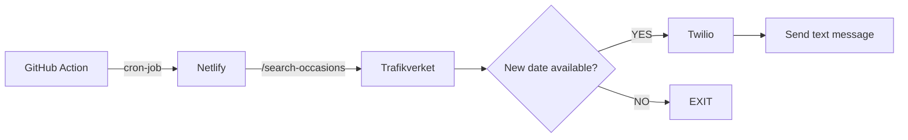

# trafikverket-boka-forarprov-sms
Receive a text message when a driving test occasion is available.

```mermaid
graph LR
    A[GitHub Action] -->|cron-job| B[Netlify] -->|/search-occasions| C[Trafikverket]
    C --> D{New date available?}
    D -->|YES| E[Twilio] --> F[Send text message]
    D -->|NO| G[EXIT]
```
