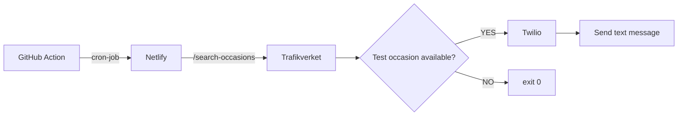

 
# boka-forarprov
Receive a text message when a driving test occasion is available at Trafikverket.

```mermaid
graph LR
    A[GitHub Action] -->|cron-job| B[Netlify] -->|/search-occasions| C[Trafikverket]
    C --> D{Test occasion available?}
    D -->|YES| E[Twilio] --> F[Send text message]
    D -->|NO| G[exit 0]
```
